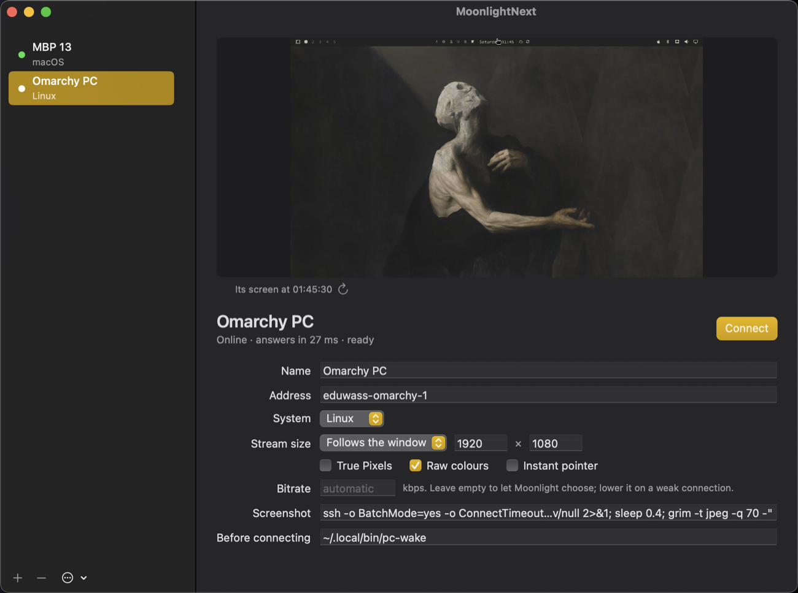

Open MoonlightNext by itself and you get the device window. The machines are on the left; the one selected is on the right.



## The list

The dot before a name is green when the machine answers. Under the name is its system and, while it has a stream, "streaming".

**+** adds a device, **−** removes the one selected. Removing a device keeps its pairing, so adding it again needs no new PIN.

The **…** menu has **Settings…**, **Pair This Device…** and **Classic Moonlight…**, which opens Moonlight's own screens.

## The picture

The picture is what is on the machine's screen now. It is fetched when you select a device and when you come back to the window, with a spinner while it loads. The round arrow fetches a new one.

A device has a picture only if you give it a **Screenshot** command: a shell command, run on your Mac, that writes an image to its standard output. Two that work:

```sh
# A Mac you can ssh into (wakes its display first)
ssh my-mac "caffeinate -u -t 5 >/dev/null 2>&1 & sleep 0.8; screencapture -x -t jpg /tmp/s.jpg && cat /tmp/s.jpg"

# A Linux machine on Wayland (wlroots, Hyprland) you can ssh into
ssh me@my-pc "XDG_RUNTIME_DIR=/run/user/1000 WAYLAND_DISPLAY=wayland-1 grim -t jpeg -q 70 -"
```

A black picture means the machine's screen is asleep: have the command wake it first, as the Mac one above does. A locked machine shows its lock screen.

## The status line

Under the name: whether it answers and how quickly, and whether a stream is open on it, to this Mac or to another.

## How a device is streamed

Changes are saved as you make them and hold from the next Connect.

| Setting | What it does |
| --- | --- |
| **Name** | What it is called here, and in [links](/links). |
| **Address** | Where it is: an IP address or a name. |
| **System** | macOS or Linux. Decides the mark on the stream's bar. |
| **Stream size** | **Follows the window**: the stream has the window's pixels and restarts when you resize it; the two numbers are the window to open, in points. **Fixed, scaled to fit**: the stream keeps the size you give, in pixels, and is scaled into the window with black bands where the shapes differ. Nothing is stretched. |
| **True Pixels** | The stream has as many pixels as the monitor's panel, not as many as macOS draws. See [the stream window](/stream-window#true-pixels). |
| **Raw colours** | Show the machine's colour values as they are. Without it macOS fits them to your display, which on a wide-gamut monitor makes a desktop look washed out next to its usual self. |
| **Instant pointer** | Your Mac draws the pointer itself, so it moves with your hand instead of one round trip later. Needs the cursor helper on the host; see [Hosts](/hosts). |
| **Bitrate** | In kbps. Empty lets the app choose by the stream's size. |
| **Screenshot** | The command for the picture, above. |
| **Before connecting** | A shell command run on your Mac before every Connect, to wake or unlock the machine. If the last line it prints is an address, the stream goes there instead of to **Address**. |

## Connect

**Connect** starts the stream in a window of its own. While a device has a stream, the button reads **Show Window** and brings that window forward, and **End Stream** beside it ends the stream for good.

**Check Link** has [the doctor](/settings#doctor) look at the way to this device and say what it can carry.

Closing the device window does not end any stream.
