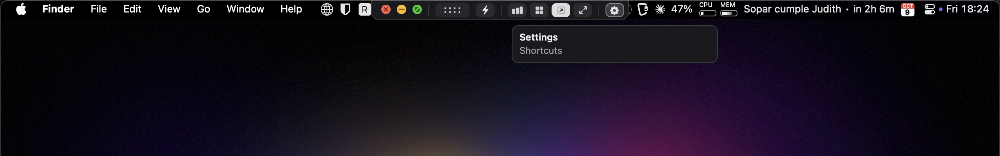

A stream's window has no title bar: the picture fills it. At the top centre is a small dark tab with an arrow. Rest the pointer on it and a bar drops down.

## The bar

From left to right:

- **The traffic lights.** Red ends the stream (or puts it out of sight, see [warm streams](/settings#general)). Yellow minimises. Green goes fullscreen.
- **The system's mark.** An Apple for a Mac, the Arch outline for Linux.
- **The handle.** Drag it to move the window.
- **The connection.** The icon is the kind of link: a bolt for Thunderbolt, a plug for Ethernet, waves for Wi-Fi, a globe for Tailscale. Rest on it for the stream's size and frame rate, the network delay and the packets lost, with a verdict: good, fair or poor. A yellow dot or a red mark beside the tab says fair or poor without opening the bar.
- **Stats.** Moonlight's numbers over the picture.
- **True Pixels.** See below.
- **Follow size.** On, the stream restarts to match the window whenever you resize it. Off, it keeps its size and is scaled to fit.
- **Fullscreen.**
- **Title bar.** Switches the window between this bar and a title bar of its own: see below. Not there in fullscreen.
- **The gear.** Opens [Settings](/settings).

While the pointer is on the bar it is your Mac's own pointer, and nothing you do there reaches the other machine.

## A title bar instead

The window can have a title bar of its own, as any window has: the three lights, the device's name, and the same switches at its right end, always there. Nothing is ever over the picture, and the window is dragged by its title bar. Switch with the bar's **Title bar** icon, or in [Settings › General](/settings#general); the choice is kept for every device.

Switching fits the window round the picture, 28 points taller or shorter, so the stream keeps its size and does not restart. Only a window already as tall as the screen gives the height from the picture, and then the stream restarts once.

Fullscreen has no title bar either way: there the bar drops from the top edge as described above, and the window has its own style again when you leave.

## True Pixels

On a monitor that macOS draws larger than its panel (a 5120 × 2160 monitor set to "looks like 3200 × 1350" is drawn at 6400 × 2700), a stream sized to the window carries pixels the glass cannot show. True Pixels sizes the stream to the panel instead. On that monitor that is 64% of the pixels: a full-height window goes from 40 to 60 frames a second, and fullscreen becomes 5120 × 2160, which a host can keep up with where 6400 × 2700 is too much.

The picture may be a touch softer, which is why it is a switch.

## From the keyboard

| Keys | Does |
| --- | --- |
| ⌃⌥⇧B | Open the bar and put the keyboard in it. Again closes it. |
| ⌃⌥⇧I | The connection's numbers. |
| ⌃⌥⇧S | Stats. |
| ⌃⌥⇧T | True Pixels. |
| ⌃⌥⇧F | Follow size. |
| ⌃⌥⇧X | Fullscreen. |
| ⌃⌥⇧W | The window's title bar, on or off. |
| ⌃⌥⇧Q | End the stream. |

With the keyboard in the bar: ← and → move, Space or Return presses, Esc leaves. Each of the first seven can be changed in [Settings › Keys](/settings#keys). A shortcut the bar takes never reaches the other machine.

## Resizing

Drag a corner. The picture holds still under a spinner while the stream restarts at the new size: between one and a half and three and a half seconds, depending on the host. If no picture arrives, the app connects again by itself.
