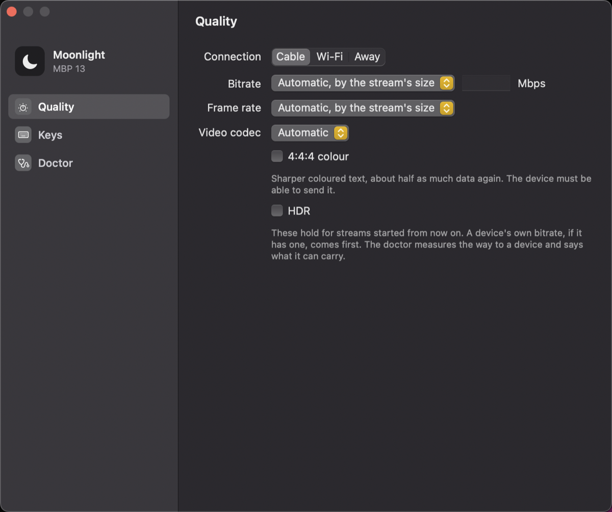
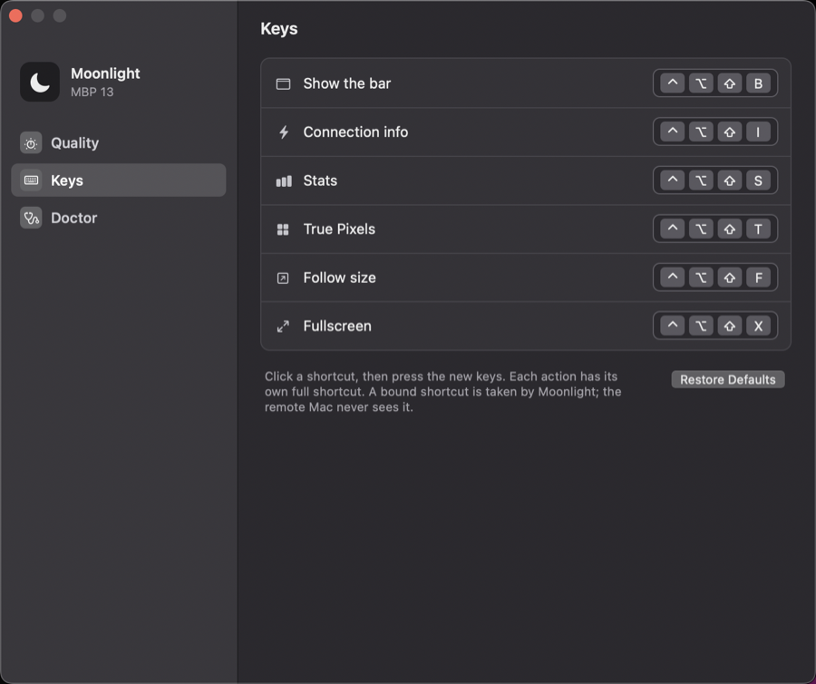
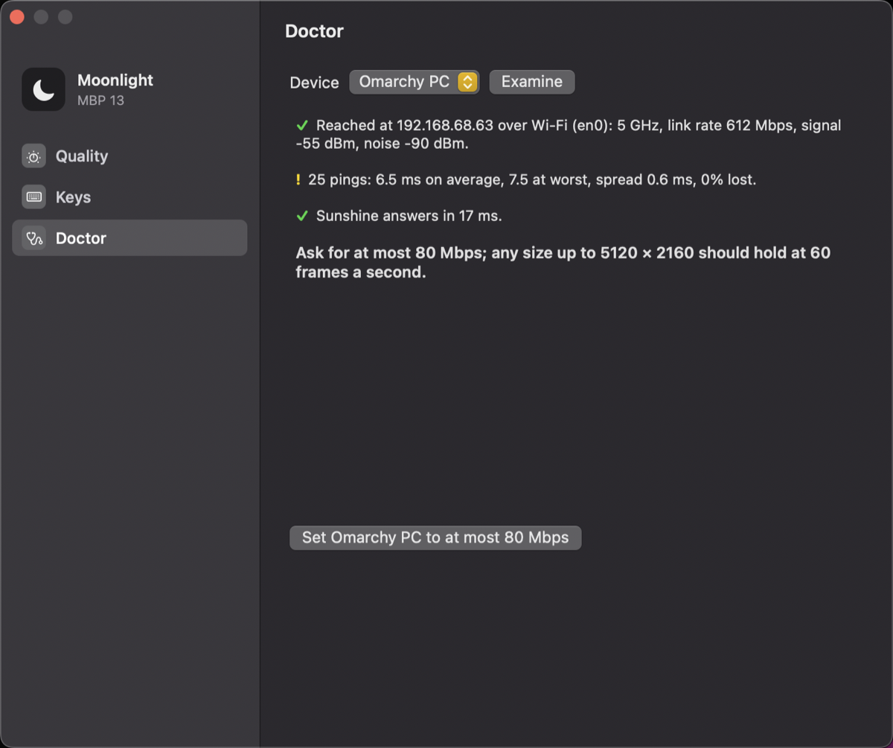

Open Settings from the gear on a stream's bar, from the **…** menu in the device window, or with the link `moonlightnext://settings`.

## General

**Closing a stream's window** decides what the red light does: end the stream, or keep it warm for 15 minutes, an hour, 2 hours, 8 hours, or until you end it.

A warm stream goes on out of sight. Its window comes back in under half a second from **Connect** in the device window, a [link](/links), or the Dock. The price: your Mac keeps decoding a picture nobody sees (about a fifth of one core) and the other machine keeps sending it. **End Stream** in the device window, or ⌃⌥⇧Q in the stream, ends it for good.

A stream in fullscreen always ends on the red light.

## Quality

These hold for streams started from now on.

| Setting | What it does |
| --- | --- |
| **Connection** | A preset. **Cable**: no limits. **Wi-Fi**: at most 40 Mbps. **Away**: at most 15 Mbps and 30 frames a second. |
| **Bitrate** | Automatic (by the stream's size) or a ceiling in Mbps. A device's own bitrate, if it has one, comes first. |
| **Frame rate** | Automatic, 60 or 30. Automatic uses each device's rule: 60 up to the size its encoder keeps up with, fewer above. |
| **Video codec** | Automatic, H.264, HEVC or AV1. |
| **4:4:4 colour** | Sharper coloured text for about half as much data again. The host must be able to send it. |
| **HDR** | For a host and a display that both have it. |

## Keys

Each action of the bar has its own complete shortcut. Click one and press the new keys. A shortcut needs ⌃, ⌥ or ⌘ in it, and two actions cannot share one. **Restore Defaults** puts all six back.

## Doctor

Pick a device and press **Examine**. In about eight seconds the doctor looks at the way a stream to that device would take:

- which kind of link it is, and for Wi-Fi the band, the link rate, the signal and the noise;
- 25 pings: the average, the worst, the spread and the loss;
- whether Sunshine answers, and whether a stream is already open on it;
- for Tailscale, whether the connection is direct or relayed.

Then it says what to ask of the link, and one button sets that device's bitrate.

The doctor measures the link, not a stream. It cannot measure real throughput, which would need something on the other machine to send test data: what a Wi-Fi link can carry is estimated from its link rate, and a wired link is taken to have plenty. A running stream's own numbers are on [its bar](/stream-window#the-bar).
